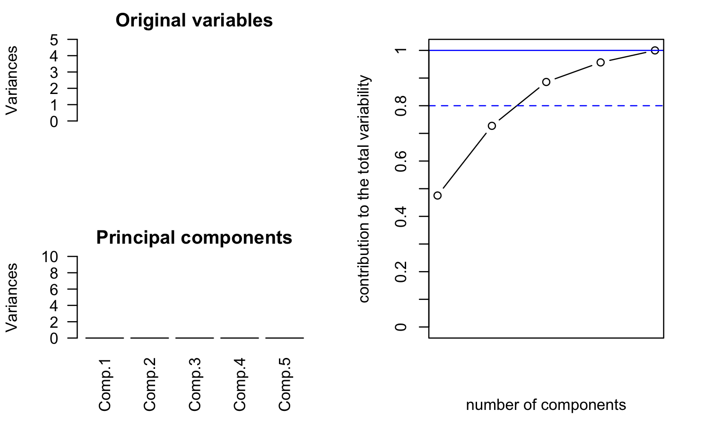

```{r setup, include=FALSE}
knitr::opts_chunk$set(echo = TRUE)
knitr::opts_knit$set(root.dir = '/Users/lucamainini/Documents/GitHub/AS_Project_2022')
```

## Import of data [to be skipped]

```{r functions}
#import nate's and luca's function
source(file.path("nate", "utils", "nate_utils.R"))
source(file.path("Luca", "luca_utils.R"))
```

```{r import data}
path = "Dataset"
#data import 
data_patient = read.delim(file.path(path, "data_clinical_patient.txt"), header = TRUE, comment.char = '#')
data_sample = read.delim(file.path(path, "data_clinical_sample.txt"), header = TRUE, comment.char = '#')
data_treatment_auc = read.delim(file.path(path, "data_drug_treatment_auc.txt"), header = TRUE, comment.char = '#')
data_rpkm = read.delim(file.path(path, "data_mrna_seq_rpkm.txt"), header = TRUE, comment.char = '#')

#--------------------------------------------------------------------------------------------
#INTERSECTION OF DATASETS BASED ON PATIENT ID/PREPROCESSING  
#THIS IS ONE POSSIBLE PATH 

#get names of patient-ids for cross-comparison
ids <-na.omit(data_patient$PATIENT_ID)
ids

#we should intersect all datasets we plan to use on the basis of patient sample-id

#intersection, carry-forward 
auc_ids <- match(ids, colnames(data_treatment_auc))
auc_ids<-na.omit(auc_ids)
reduced_auc_ids <-colnames(data_treatment_auc)[auc_ids]

sample_ids <- match(reduced_auc_ids, data_sample$PATIENT_ID)
sample_ids<-na.omit(sample_ids)
reduced_sample_ids <-data_sample$PATIENT_ID[sample_ids]

mrna_ids<-match(reduced_sample_ids, colnames(data_rpkm))
mrna_ids<-na.omit(mrna_ids)
reduced_mrna_ids <-colnames(data_rpkm)[mrna_ids]

reduced_ids<-reduced_mrna_ids

#REASSIGNMENT 
auc <-data_treatment_auc[,c(reduced_ids)]
rownames(auc)<-data_treatment_auc$ENTITY_STABLE_ID

rpkm <-data_rpkm[,c(reduced_ids)]
rpkm["row_names"]<-data_rpkm$Hugo_Symbol
#prova <- select(rpkm, -row_names)

#----------------------------------------------------------------------------------------------

#unique names from reduced 
cancer_types = unique(str_util(reduced_ids))
cancer_freqs <- factor(str_util(reduced_ids), levels=cancer_types)

#cleaning 
#rm(data_patient, data_sample, data_treatment_auc, path, reduced_auc_ids,reduced_mrna_ids, reduced_sample_ids)

## WORKING ON BREAST CANCER

type ="BREAST"
#prova <- select(rpkm, -row_names)
rpkm = data_frame(rpkm)
selected_cells = colnames(rpkm)[grepl(type, colnames(rpkm))]
cell_indices = match(selected_cells,colnames(rpkm))
to_return = rpkm[, cell_indices]
to_return['hugo_symbol'] = rpkm$row_names
save(to_return, file = "breast_data_RPKM.Rdata")
```

## LOAD DIRECTLY

```{r load data}
load(file.path("Dataset","breast_data_RPKM.Rdata"))
```

```{r match_with_auc}
load(file.path("Dataset","breast_auc_data.Rdata"))
breast_auc = t(breast_data_treatment_auc)
chosen_patients <- match(colnames(to_return_2),colnames(breast_data_treatment_auc))
chosen_patients<-na.omit(chosen_patients)
breast_auc = to_return_2[,chosen_patients]
breast_auc['hugo_symbol'] = to_return_2$hugo_symbol
```

```{r}
# Keep only non duplicated element

# We still end up with a few duplicate element especially Y-RNA
# But we decided not to deal with this for now
library(dplyr)
#duplicated_values <- duplicated(data_expression)
data_expression_clean <- distinct(breast_auc, .keep_all=TRUE)


# PROBLEM 2: Removing lines with low variance
# To select the feature for our cluster analysis, we need first to reduce the number of genes considered.
# We first decide to select the genes with highest variability between the different cell lines
# This approach is motivated by the fact that if there is no variability between the different observations, cluster won't be possible

# we first create a separated matrix of normalized data
M <- scale(select(data_expression_clean, -hugo_symbol))

threshold <- 0.7 #10
row_var = apply(M, 1, var) #apply over rows: variability of all the genes along the cell lines
plot(row_var)

sum(row_var > threshold)
plot(row_var[row_var > threshold])

data_exp_var <- data_expression_clean[row_var > threshold,]

```

```{r}
sum(duplicated(data_exp_var$hugo_symbol))
rownames(data_exp_var)<-data_exp_var$hugo_symbol
#data_exp_var$hugo_symbol <- NULL
temp <- data_exp_var[,-dim(data_exp_var)[2]]
rownames(temp)<-data_exp_var$hugo_symbol
temp
```

```{r}
#write.csv(row.names(data_exp_var),file="genes.csv",row.names=F)
breast_rpkm <- t(temp)
#breast_rpkm <- breast_rpkm_t[-nrow(breast_rpkm_t),]

```


```{r}
#install.packages("zoo")                                    # Install & load zoo package
library("zoo")
```

```{r}
library(plotly)
fig <- plot_ly(
    x = colnames(breast_rpkm), y = rownames(breast_rpkm),
    colors = colorRamp(c("green", "blue")),
    z = as.matrix(breast_rpkm), type = "heatmap"
)  
fig
```
```{r}
chosen_mt <- grepl("MT-", colnames(breast_rpkm))
to_cancel = breast_rpkm[, chosen_mt] 
data_5 <- breast_rpkm[,as.logical(1-chosen_mt)]
fig <- plot_ly(
    x = colnames(data_5), y = rownames(data_5),
    colors = colorRamp(c("green", "blue")),
    z = as.matrix(data_5), type = "heatmap"
)  
fig
```

```{r}
breast_rpkm_means = apply(as.matrix(data_5),2,mean)
sum(breast_rpkm_means>1000)
expressed_genes <- data_5[,breast_rpkm_means>1000]
```

```{r}
data_5 <- as.matrix(breast_rpkm)
apply(data_5,2,mean)
library(plotly)
fig <- plot_ly(
    x = colnames(data_5), y = rownames(data_5),
    colors = colorRamp(c("red", "green")),
    z = as.matrix(data_5), type = "heatmap"
)  
fig
```
## VISUALIZATION OF DATA
```{r}
load(GGally)
```

```{r}
data_p = data.frame(data_5)
row.names(data_p)=row.names(data_5)
ggpairs(data_p, # data.frame with variables
             columns = 1:5,
             #aes(colour=class, alpha = 0.5)
        )
```


## PCA



```{r pca space}
pca <- princomp(data_5, scores=T)

# Loadings
load<- pca$loadings #eigen(S)
load

#x11()
par(mar = c(1,4,0,2), mfrow = c(5,1))
for(i in 1:5)
  barplot(load[,i], ylim = c(-1, 1))

# plot on the space generated by the first k principal components
M <- sapply(data_5[,1:3],mean)
S <- cov(data_5[,1:3])

open3d()
points3d(pca$scores[,1:3], asp=1, size=5)
axes3d()


```

```{r}
cat("Outliers detection for PCs: \n")
for(i in 1:5){
  chosen <- paste("Comp.", i, sep = "")
  chosen <- scores[[chosen]]
  out<-boxplot.stats(chosen)$out
  cat("PC ", i, ": ", which(chosen %in% c(out)), "\n")
}
```

```{r}
# We plot the outlying data for the first 2 PCs
color.outliers <- NULL
for (i in 1:dim(data_5)[1]){
  color.outliers[i] <- 'blue'
}

outliers_1 <- c(26) #pc1
outliers_2 <- c(9, 10, 12, 21, 25, 43 ) #pc2
outliers_2_3 <- c(9, 12, 25, 43 ) #pc2_3
outliers_3 <- c(9, 12, 20, 26, 43 ) #pc2

for (i in outliers_1){
  color.outliers[i] <- 'red'
}

for (i in outliers_2){
  color.outliers[i] <- 'green'
}

for (i in outliers_3){
  color.outliers[i] <- 'orange'
}

for (i in outliers_2_3){
  color.outliers[i] <- 'brown'
}

pairs(data, col=color.outliers, pch=16, main='Scatter plot - Outliers')


open3d()
points3d(pca$scores[,1:3],col=color.outliers, asp=1, size=5)
title3d("PCA scores", xlab="PC1", ylab="PC2", zlab="PC3")
axes3d()

open3d(windowRect=c(100,100,1000,1000))
points3d(data_5[,1:3],col=color.outliers, asp=1, size=5)
title3d("OUTLIERS on first 3 treatments direction", xlab="AVA", ylab= 
          "BIC", zlab="LIN")
axes3d()
```


## HIERARCHICAL CLUSTERING
```{r}
library(mvtnorm)
library(rgl)
library(car)
```

```{r dissimilarity_matrix of ordered data}
# compute the dissimilarity matrix of the data
# we choose the Euclidean metric (and then we look at other metrics)

#help(dist)
d.e <- dist(data_5, method='euclidean')

image(1:46,1:46,as.matrix(d.e), main='metrics: Euclidean', asp=1, xlab='i', ylab='j')

# with other metrics:
d.m <- dist(data_5, method='manhattan')
d.c <- dist(data_5, method='canberra')

##xquartz()
par(mfrow=c(1,3))
image(1:46,1:46,as.matrix(d.e), main='metrics: Euclidean', asp=1, xlab='i', ylab='j' )
image(1:46,1:46,as.matrix(d.c), main='metrics: Canberra', asp=1, xlab='i', ylab='j' )
image(1:46,1:46,as.matrix(d.m), main='metrics: Manhattan', asp=1, xlab='i', ylab='j' )
```

```{r}
fig <- plot_ly(
    #x = colnames(data_5), y = rownames(data_5),
    #colors = colorRamp(c("red", "green")),
    z = as.matrix(d.e), type = "heatmap"
)  
fig
```

Le matrici sembrano simili, da cui ipotizziamo che cambiare la distanza non porterà a grandi differenze.

```{r euclidian}
d.es <- hclust(d.e, method='single')
d.ea <- hclust(d.e, method='average')
d.ec <- hclust(d.e, method='complete')

ward <- hclust(d.e, method='ward.D2')

# plot of the dendrograms
##xquartz()
par(mfrow=c(1,3))
plot(d.es, main='euclidean-single', hang=-0.1, xlab='', labels=F, cex=0.6, sub='')
plot(d.ec, main='euclidean-complete', hang=-0.1, xlab='', labels=F, cex=0.6, sub='')
plot(d.ea, main='euclidean-average', hang=-0.1, xlab='', labels=F, cex=0.6, sub='')

# plot dendrograms (with eucledian it seems 2 clusters)
##xquartz()
par(mfrow=c(1,3))
plot(d.es, main='euclidean-single', hang=-0.1, xlab='', labels=F, cex=0.6, sub='')
rect.hclust(d.es, k=2)
plot(d.ec, main='euclidean-complete', hang=-0.1, xlab='', labels=F, cex=0.6, sub='')
rect.hclust(d.ec, k=3)
plot(d.ea, main='euclidean-average', hang=-0.1, xlab='', labels=F, cex=0.6, sub='')
rect.hclust(d.ea, k=4)

#plot(ward, hang=-0.1, labels=FALSE, main='ward', xlab='', sub='')

# How to cut a Dendrogram?
# We generate vectors of labels through the command cutree()
#help(cutree)

# Fix k=2 clusters:
cluster.ec <- cutree(d.ec, k=2) # euclidean-complete:
cluster.ec

cluster.es <- cutree(d.es, k=3) # euclidean-single
cluster.ea <- cutree(d.ea, k=4) # euclidean-average

cluster.ew <- cutree(ward, k=4) #ward divide il gruppo grosso in 2


# points3d(data_5[,1:3],col=color.outliers, asp=1, size=5)
# title3d("OUTLIERS on first 3 treatments direction", )
# 
# open3d(windowRect=c(100,100,1000,1000))
# plot3d(data_5, size=3, col=cluster.ew +1, aspect = F, xlab="AVA", ylab= 
#           "BIC", zlab="LIN") 
# title = deparse(substitute(cluster.w))
# title3d(title)
# axes3d()
# name = paste(title, "png", sep = ".")
# rgl.snapshot(filename = name)
# 
# open3d(windowRect=c(100,100,1000,1000))
# plot3d(data_5, size=3, col=cluster.es +1, aspect = F, xlab="AVA", ylab= 
#           "BIC", zlab="LIN") 
# title = deparse(substitute(cluster.es))
# title3d(title)
# axes3d()
# name = paste(title, "png", sep = ".")
# rgl.snapshot(filename = name)
# 
# 
# open3d(windowRect=c(100,100,1000,1000))
# plot3d(data_5, size=3, col=cluster.ea +1, aspect = F, xlab="AVA", ylab= 
#           "BIC", zlab="LIN") 
# title = deparse(substitute(cluster.ea))
# title3d(title)
# axes3d()
# name = paste(title, "png", sep = ".")
# rgl.snapshot(filename = name)
# 
# open3d(windowRect=c(100,100,1000,1000))
# plot3d(data_5, size=3, col=cluster.ec +1, aspect = F, xlab="AVA", ylab= 
#           "BIC", zlab="LIN") 
# title = deparse(substitute(cluster.ec))
# title3d(title)
# axes3d()
# name = paste(title, "png", sep = ".")
# rgl.snapshot(filename = name)
```

```{r}
plot(data_5[,4:6] , col=cluster.es+1, asp=1, pch=16, lwd=2)
# pairs(data_5 , col=cluster.es+1, asp=1, pch=16, lwd=2)
# pairs(data_5 , col=cluster.ec+1, asp=1, pch=16, lwd=2)
# pairs(data_5 , col=cluster.ea+1, asp=1, pch=16, lwd=2)
# pairs(data_5 , col=cluster.w+1, asp=1, pch=16, lwd=2)
```

```{r cophenetic}
coph.es <- cophenetic(d.es)
coph.ec <- cophenetic(d.ec)
coph.ea <- cophenetic(d.ea)
coph.w <- cophenetic(ward)

layout(rbind(c(0,1,0,0),c(2,3,4,5)))
image(as.matrix(d.e), main='Euclidean', asp=1 )
image(as.matrix(coph.es), main='Single', asp=1 )
image(as.matrix(coph.ec), main='Complete', asp=1 )
image(as.matrix(coph.ea), main='Average', asp=1 )
image(as.matrix(coph.w), main='Ward', asp=1 )

# compute cophenetic coefficients
es <- cor(d.e, coph.es)
ec <- cor(d.e, coph.ec)
ea <- cor(d.e, coph.ea)
ew <- cor(d.e, coph.w)
c("Eucl-Single"=es,"Eucl-Compl."=ec,"Eucl-Ave."=ea, "Ward"=ew )
```

AVERAGE 4 IS THE ONE RETAINED

```{r}
data_p = data.frame(data_5)
row.names(data_p)=row.names(data_5)
data_p$class = as.factor(cluster.ec)
ggpairs(data_p, # data.frame with variables
             columns = 1:5,
             aes(colour=class, alpha = 0.5)
        )

```

```{r camperra}
d.cs <- hclust(d.c, method='single')
d.ca <- hclust(d.c, method='average')
d.cc <- hclust(d.c, method='complete')
d.cw <- hclust(d.c, method='ward.D2')

# plot of the dendrograms
##xquartz()
par(mfrow=c(1,3))
plot(d.cs, main='euclidean-single', hang=-0.1, xlab='', labels=F, cex=0.6, sub='')
plot(d.cc, main='euclidean-complete', hang=-0.1, xlab='', labels=F, cex=0.6, sub='')
plot(d.ca, main='euclidean-average', hang=-0.1, xlab='', labels=F, cex=0.6, sub='')

##xquartz()
par(mfrow=c(1,3))
plot(d.cs, main='euclidean-single', hang=-0.1, xlab='', labels=F, cex=0.6, sub='')
rect.hclust(d.cs, k=2)
plot(d.cc, main='euclidean-complete', hang=-0.1, xlab='', labels=F, cex=0.6, sub='')
rect.hclust(d.cc, k=3)
plot(d.ca, main='euclidean-average', hang=-0.1, xlab='', labels=F, cex=0.6, sub='')
rect.hclust(d.ca, k=4)

#plot(d.cw, main='euclidean-average', hang=-0.1, xlab='', labels=F, cex=0.6, sub='')
#rect.hclust(d.cw, k=2)

# How to cut a Dendrogram?
# We generate vectors of labels through the command cutree()
#help(cutree)

# Fix k=2 clusters:

cluster.cs <- cutree(d.cs, k=2) # euclidean-single
cluster.cc <- cutree(d.cc, k=3) # euclidean-complete:
cluster.ca <- cutree(d.ca, k=4) # euclidean-average
cluster.cw <- cutree(d.ca, k=2) # euclidean-average

pairs(data_5 , col=cluster.cs+1, asp=1, pch=16, lwd=2)
pairs(data_5 , col=cluster.cc+1, asp=1, pch=16, lwd=2)
pairs(data_5 , col=cluster.ca+1, asp=1, pch=16, lwd=2)

open3d(windowRect=c(100,100,1000,1000))
plot3d(data_5, size=3, col=cluster.cw +1, aspect = F, xlab="AVA", ylab= 
          "BIC", zlab="LIN") 
title = deparse(substitute(cluster.cw))
title3d(title)
axes3d()
name = paste(title, "png", sep = ".")
rgl.snapshot(filename = name)

open3d(windowRect=c(100,100,1000,1000))
plot3d(data_5, size=3, col=cluster.cs +1, aspect = F, xlab="AVA", ylab= 
          "BIC", zlab="LIN") 
title = deparse(substitute(cluster.cs))
title3d(title)
axes3d()
name = paste(title, "png", sep = ".")
rgl.snapshot(filename = name)


open3d(windowRect=c(100,100,1000,1000))
plot3d(data_5, size=3, col=cluster.ca +1, aspect = F, xlab="AVA", ylab= 
          "BIC", zlab="LIN") 
title = deparse(substitute(cluster.ca))
title3d(title)
axes3d()
name = paste(title, "png", sep = ".")
rgl.snapshot(filename = name)


open3d(windowRect=c(100,100,1000,1000))
plot3d(data_5, size=3, col=cluster.cc +1, aspect = F, xlab="AVA", ylab= 
          "BIC", zlab="LIN") 
title = deparse(substitute(cluster.cc))
title3d(title)
axes3d()
name = paste(title, "png", sep = ".")
rgl.snapshot(filename = name)


```

```{r camperra cophenetic}
coph.cs <- cophenetic(d.es)
coph.cc <- cophenetic(d.ec)
coph.ca <- cophenetic(d.ea)
coph.cw <- cophenetic(d.cw)

layout(rbind(c(0,1,0,0),c(2,3,4,5)))
image(as.matrix(d.e), main='Euclidean', asp=1 )
image(as.matrix(coph.es), main='Single', asp=1 )
image(as.matrix(coph.ec), main='Complete', asp=1 )
image(as.matrix(coph.ea), main='Average', asp=1 )
image(as.matrix(coph.cw), main='Ward', asp=1 )

# compute cophenetic coefficients
es <- cor(d.e, coph.es)
ec <- cor(d.e, coph.ec)
ea <- cor(d.e, coph.ea)
ew <- cor(d.e, coph.cw)
c("Eucl-Single"=es,"Eucl-Compl."=ec,"Eucl-Ave."=ea, "Ward"=ew )
```

```{r manhattan}
d.m <- dist(data_5, method='manhattan')
d.ms <- hclust(d.m, method='single')
d.ma <- hclust(d.m, method='average')
d.mc <- hclust(d.m, method='complete')

d.mw <- hclust(d.m, method='ward.D2')

# plot of the dendrograms
##xquartz()
par(mfrow=c(1,3))
plot(d.ms, main='euclidean-single', hang=-0.1, xlab='', labels=F, cex=0.6, sub='')
plot(d.mc, main='euclidean-complete', hang=-0.1, xlab='', labels=F, cex=0.6, sub='')
plot(d.ma, main='euclidean-average', hang=-0.1, xlab='', labels=F, cex=0.6, sub='')

# plot dendrograms (with eucledian it seems 2 clusters)
##xquartz()
par(mfrow=c(1,3))
plot(d.ms, main='euclidean-single', hang=-0.1, xlab='', labels=F, cex=0.6, sub='')
rect.hclust(d.ms, k=3)
plot(d.mc, main='euclidean-complete', hang=-0.1, xlab='', labels=F, cex=0.6, sub='')
rect.hclust(d.mc, k=4)
plot(d.ma, main='euclidean-average', hang=-0.1, xlab='', labels=F, cex=0.6, sub='')
rect.hclust(d.ma, k=4)

#plot(ward, hang=-0.1, labels=FALSE, main='ward', xlab='', sub='')

# How to cut a Dendrogram?
# We generate vectors of labels through the command cutree()
#help(cutree)

# Fix k=2 clusters:
cluster.mc <- cutree(d.mc, k=3) # euclidean-complete

cluster.ms <- cutree(d.ms, k=4) # euclidean-single
cluster.ma <- cutree(d.ma, k=4) # euclidean-average

cluster.mw <- cutree(d.mw, k=2) #ward divide il gruppo grosso in 2

open3d(windowRect=c(100,100,1000,1000))
plot3d(data_5, size=3, col=cluster.mw +1, aspect = F, xlab="AVA", ylab= 
          "BIC", zlab="LIN") 
title = deparse(substitute(cluster.mw))
title3d(title)
axes3d()
name = paste(title, "png", sep = ".")
rgl.snapshot(filename = name)

open3d(windowRect=c(100,100,1000,1000))
plot3d(data_5, size=3, col=cluster.ms +1, aspect = F, xlab="AVA", ylab= 
          "BIC", zlab="LIN") 
title = deparse(substitute(cluster.ms))
title3d(title)
axes3d()
name = paste(title, "png", sep = ".")
rgl.snapshot(filename = name)

open3d(windowRect=c(100,100,1000,1000))
plot3d(data_5, size=3, col=cluster.ma +1, aspect = F, xlab="AVA", ylab= 
          "BIC", zlab="LIN") 
title = deparse(substitute(cluster.ma))
title3d(title)
axes3d()
name = paste(title, "png", sep = ".")
rgl.snapshot(filename = name)

open3d(windowRect=c(100,100,1000,1000))
plot3d(data_5, size=3, col=cluster.mc +1, aspect = F, xlab="AVA", ylab= 
          "BIC", zlab="LIN") 
title = deparse(substitute(cluster.mc))
title3d(title)
axes3d()
name = paste(title, "png", sep = ".")
rgl.snapshot(filename = name)
```

```{r}
pairs(data_5 , col=cluster.ms+1, asp=1, pch=16, lwd=2)
pairs(data_5 , col=cluster.mc+1, asp=1, pch=16, lwd=2)
pairs(data_5 , col=cluster.ma+1, asp=1, pch=16, lwd=2)
pairs(data_5 , col=cluster.mw+1, asp=1, pch=16, lwd=2)
```

```{r camperra cophenetic}
coph.cs <- cophenetic(d.es)
coph.cc <- cophenetic(d.ec)
coph.ca <- cophenetic(d.ea)
coph.cw <- cophenetic(d.cw)

layout(rbind(c(0,1,0,0),c(2,3,4,5)))
image(as.matrix(d.e), main='Euclidean', asp=1 )
image(as.matrix(coph.es), main='Single', asp=1 )
image(as.matrix(coph.ec), main='Complete', asp=1 )
image(as.matrix(coph.ea), main='Average', asp=1 )
image(as.matrix(coph.cw), main='Ward', asp=1 )

# compute cophenetic coefficients
es <- cor(d.e, coph.es)
ec <- cor(d.e, coph.ec)
ea <- cor(d.e, coph.ea)
ew <- cor(d.e, coph.cw)
c("Eucl-Single"=es,"Eucl-Compl."=ec,"Eucl-Ave."=ea, "Ward"=ew )
```

## K-MEANS

```{r}
result.k <- kmeans(data_5, centers=3) # Centers: fixed number of clusters

#library(factoextra)
fviz_nbclust(data_5, FUN = kmeans, method = "silhouette") 
fviz_nbclust(data_5, FUN = kmeans, method = "wss")
# 3 clusters being optimal, could go to 7

# experimenting with the number of clusters
result.k <- kmeans(M, centers=4) # Centers: fixed number of clusters

open3d(windowRect=c(100,100,1000,1000))
plot3d(data_5, size=3, col=result.k$cluster +1, aspect = F, xlab="AVA", ylab= 
          "BIC", zlab="LIN") 
title = "K-means cluster (4)"
title3d(title)
axes3d()
rgl.snapshot(filename = "auc_4_means.png")
```

