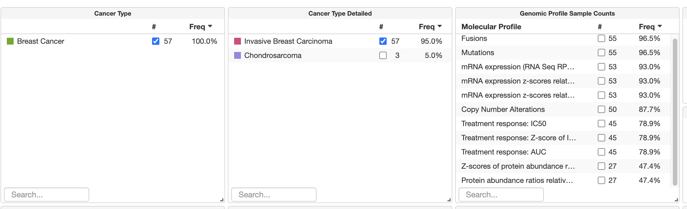

```{r setup, include=FALSE}
knitr::opts_chunk$set(echo = TRUE)
```

## 1.IMPORT DATASET

```{=tex}
\begin{itemize}
  \item In data_drug_treatment_auc, you can find the auc measure of drug treatment response.
  \item In data_sample, you find all the data on studied cells. 
\end{itemize}
```

```{r}
# The dataset should be imported in a folder called "Dataset"

data_patient= read.delim(file.path("Dataset", "data_clinical_patient.txt"), header = TRUE, comment.char = '#')

data_treatment_auc= read.delim(file.path("Dataset", 'data_drug_treatment_auc.txt'), header = TRUE, comment.char = '#')

data_sample= read.delim(file.path("Dataset",'data_clinical_sample.txt'), header = TRUE, comment.char = '#')
```

## Selecting Invasive Breast Carcinoma data

Let's focus on Breast Cancer. First, we need to understand which studied cells of data_sample were taken by patients Invasive Breast Carcinoma patients.

```{r}
selected_values =data_sample[data_sample$"CANCER_TYPE_DETAILED"=="Invasive Breast Carcinoma",]
selected_cells = selected_values$SAMPLE_ID

selected_cells = na.omit(selected_cells) #57 values
#selected_cells = as.character(na.omit(selected_cells)) #57 values
selected_cells
```

 Apparently, some of this cells weren't studied in vitro: indeed these columns are not present in the data_treatment_auc dataset (you can see that in auc we have just 45)

```{r eval=FALSE, message=TRUE, warning=TRUE, include=FALSE}
for (i in 1:57){
  print(paste0("Looking for ", selected_cells[i]) )
  reduced_dataset = data_treatment_auc[selected_cells[i]]
  reduced_dataset
}
```

HS739T_FIBROBLAST is not present in the colnames.

```{r}
indexes = match(selected_cells, colnames(data_treatment_auc))
indexes
```

I can't understand why finally I receive only 43 values instead of 45

```{r}
sum(is.na(indexes))
```

```{r eval=FALSE, include=FALSE}
#example of how using match
x <- sample(1:10)
x 
match(c(4,8),x)
```

```{r}
cancer_data_treatment_auc = data_treatment_auc[, na.omit(indexes)]
str(cancer_data_treatment_auc)
```
